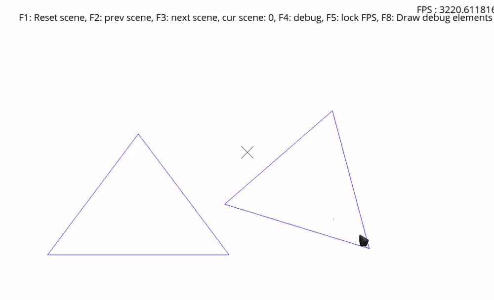
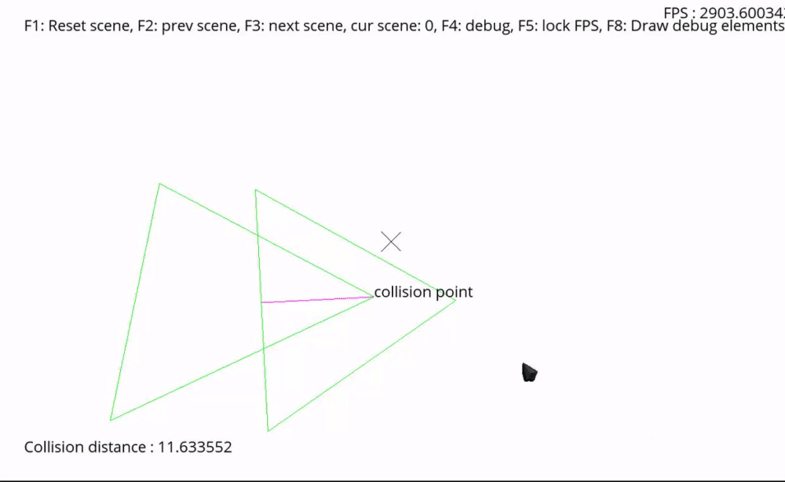
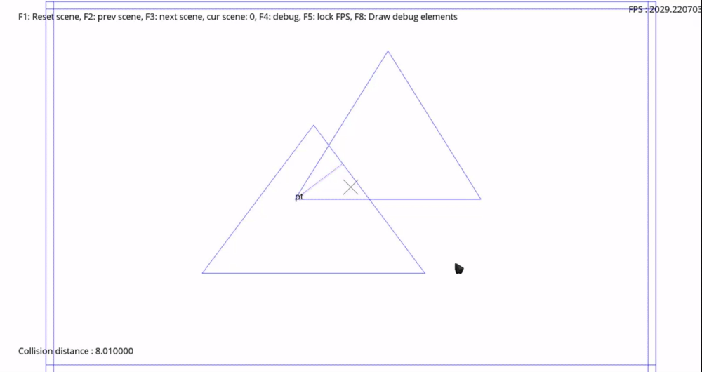
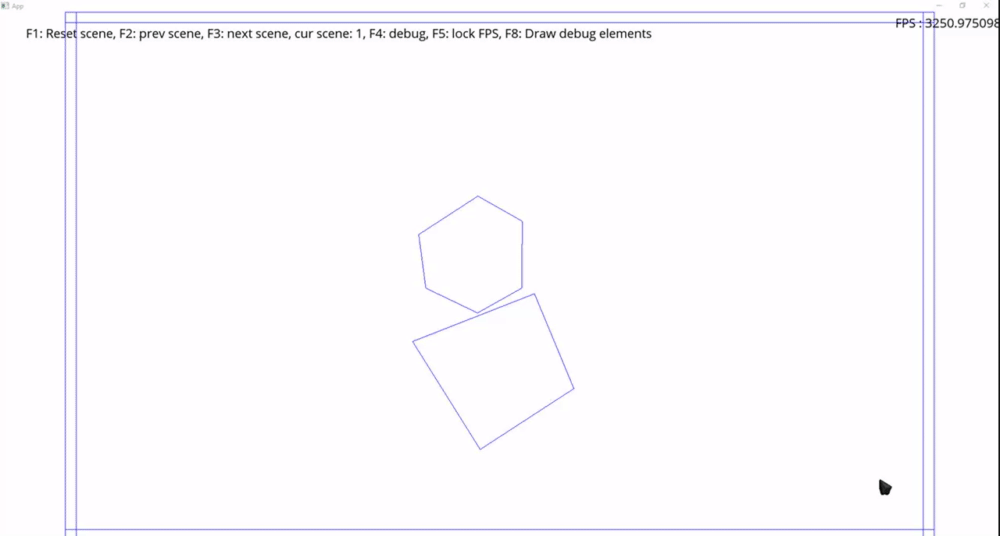

# Collision Detection Project

The goal of the project is to implement a performant collision detection algorithm which composes of a Broad phase, a Narrow phase, and a collision response.

## Features states

**Broad phase** : Completed, I implemented the Sweep and Prune algorithm because it is the most performant algorithm for 2D collision detection and is very easy to implement. I also for experiment purposes improve the Brut force algorithm. All broad phase algorithm inherits from the Broad phase interface and can be founded in the Broad Phase folder.

**Narrow phase** : Completed, I implemented my own version of the GJK and EPA algorithms. 

**Debug tools** : I also created an optimized AABB creator and drawer to create/modify AABB only when needed to save performance.
In addition to the optimized AABB creator/drawer, i implemented new inputs to help visualize collision elements:
-F8 to open the draw debug element menu + visualization.
-Numpad 0,1,2,3,4,5,6 to toggle some elements which should be drawn or not.
those toggled elements are :
-AABB colliding state (blue == not colliding, green == colliding) (Num0).
-minkowski shape and minkowski creation (Num1 and Num2).
-GJK last simplex and collision hit result (the purple line) (Num3 and Num4).
-Collission (Num5).
-Gravity (Num6).

The base color for colliding shape is the same as the AABB (blue == not colliding, green == colliding).

**Response** : I implemented a sequencial collision response with constraint solver.
I handled the position and velocity constraints and also included a warm start to help with stabilization.
I also handled friction. All the collision response is based on impulse.
The system also keep in memory previous contact to improve stabilization.

The system has a major issues with stabilization because constraint solver should have more than one point of collision for surface that are stick to each other.
As my system only have 1 point, it result with big impulse when object are sitcking together so an effect of explosion might be seen because of the point being far away which increase the impulse intensity.
Also static object create sometimes too big impulse as their inverse weight is zero.

Without those mentionned problem the system would be almost perfect.

## Clips
**Broad phase**

**Narrow phase**

**Response**

> Note: All gifs/clips were taken with gyazo, as so the framerate is low to save on file size.
