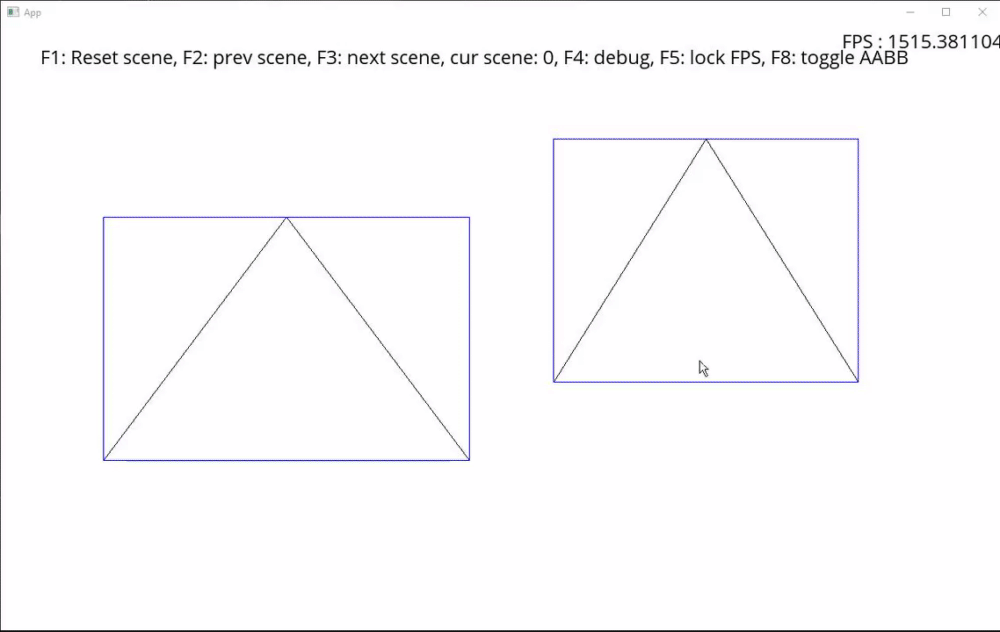

# Collision Detection Project

The goal of the project is to implement a performant collision detection algorithm which composes of a Broad phase, a Narrow phase, and a collision response.

## Features states

**Broad phase** : Completed, I implemented the Sweep and Prune algorithm because it is the most performant algorithm for 2D collision detection and is very easy to implement. I also for experiment purposes improve the Brut force algorithm. All broad phase algorithm inherits from the Broad phase interface and can be founded in the Broad Phase folder.

**Debug tools** : I also created an optimized AABB creator and drawer to create/modify AABB only when needed to save performance.
I also added an input on F8 to visualize AABB and their colliding state (blue == not colliding, green == colliding).

> Note: All gifs/clips were taken with gyazo, as so the framerate is low to save on file size.
